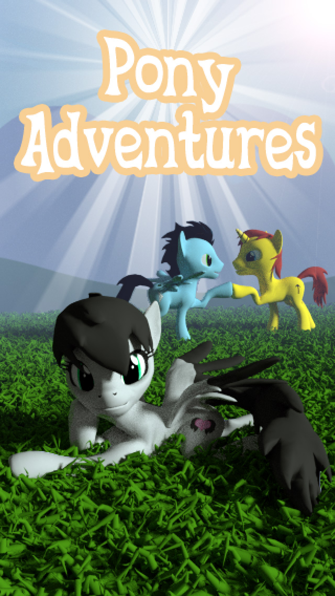
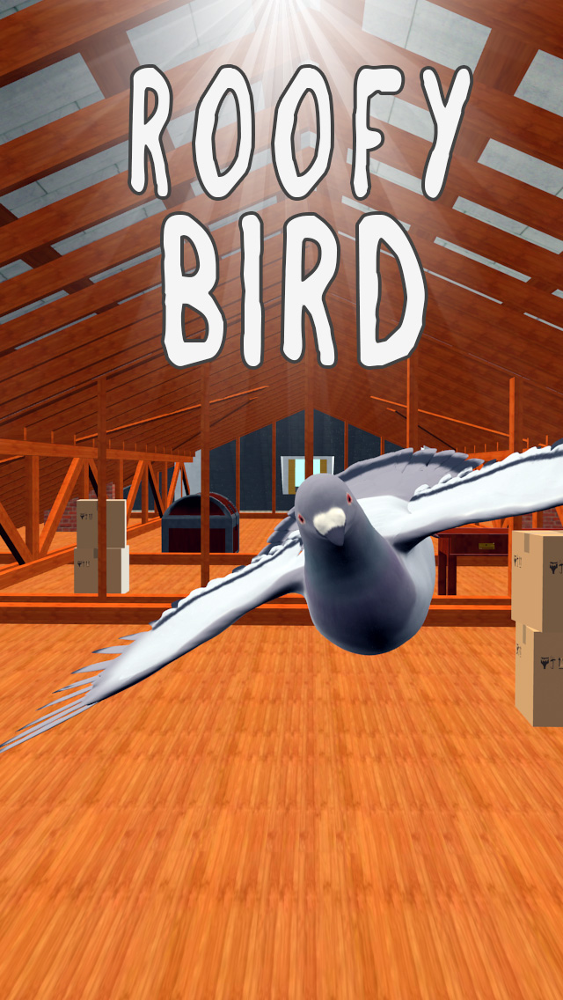

<!DOCTYPE html>
<html>
  <head>
    <title>SanMoreGames - official page</title>
	  <link rel="icon" href="/img/Logo_SMG32x32.png">
    <meta charset="utf-8" />
    <meta content="width=device-width, initial-scale=1, maximum-scale=1, user-scalable=no" name="viewport">
    <!-- CSS 
        ================================================== -->
    <!-- Bootstrap 3-->
    <link href="css/bootstrap.min.css" rel="stylesheet" media="screen">
    <!-- Google Fonts -->
    <link href='https://fonts.googleapis.com/css?family=Source+Sans+Pro:200,300,400,600,700,900,200italic,300italic,400italic,600italic,700italic,900italic|Roboto+Condensed:300italic,400italic,700italic,400,300,700' rel='stylesheet' type='text/css'>
    <link href='https://fonts.googleapis.com/css?family=Roboto+Condensed:300italic,400italic,700italic,400,300,700' rel='stylesheet' type='text/css'>
    <!-- Template Styles -->
    <link href="css/style.css" rel="stylesheet" media="screen">
      </head>
  <body>
	  
	  <!-- NAVBAR
	      ================================================== -->
	  <nav class="navbar navbar-default" role="navigation">
	  	  

			  

			    <button type="button" class="navbar-toggle" data-toggle="collapse" data-target=".navbar-ex1-collapse">
			      Toggle navigation
			      
			      
			      
			    </button>
			    
			    <!--Replace text with your app name or logo image-->
			    
			    
			  

			  

			    <ul class="nav navbar-nav">
			      <li><a onclick="$('header').animatescroll({padding:71});">Home</a></li>
			      <li><a onclick="$('.detail').animatescroll({padding:71});">Projects</a></li>
			      <li><a onclick="$('.features').animatescroll({padding:71});">Features</a></li>
			      <li><a onclick="$('.social').animatescroll({padding:71});">Social	</a></li>
			    </ul>
			  

		  

	  </nav>
	  
	  
	   <!-- HEADER
	   ================================================== -->	  
	  <header>
		 

			 

				 

					  <h1>BE AWESOME</h1>
					  
SanMoreGames LLC

					  
					  

					  	

					    
					    <!-- Indicators -->
					    <ol class="carousel-indicators">
					      <li data-target="#carousel-example-generic" data-slide-to="0" class="active"></li>
					      <li data-target="#carousel-example-generic" data-slide-to="1"></li>
					      <!-- <li data-target="#carousel-example-generic" data-slide-to="2"></li> -->
					    </ol>
					  
					    <!-- Wrapper for slides -->
					    

					      

					        
					      

					      

					        
					      

					     <!-- 

					        
					      
 -->
					      
					    

					  

					

				
	  
			
    
		

	 </header>
	  
	  
	  <!-- PURCHASE
	      ================================================== -->
	  <section class="purchase">
		  

			  

				  

					<h1>Available now on the App Store and Google Play</h1>
					  
Free download and play

					  	<button type="button" class="app-store" onClick='location.href="https://itunes.apple.com/us/developer/san-more-games-llc/id1075093107"'></button>
                        <button type="button" class="google_play" onClick='location.href="https://play.google.com/store/apps/developer?id=SanMoreGames&hl=ru"'></button>
				  

			  

		  

	  </section>
	  
	  
	  <!-- PAYOFF 
	      ================================================== -->
	  <section class="payoff">
		

			  

				  

					  <h1>San More Games.</h1>
                      <p1 class="lead">This is a Ukrainian company that specializes in developing games for mobile platforms.
						  The company's history began in 2014, with the start of the game development for Android, called Pigeon Simulator, but the development has not been completed. On this basis developed game Roofy Bird, which is a kind of runner arcade. The development of two more games was suspended due to the development of the game Pony Adventures. 
						  Whole year the company had one developer, one run was very difficult. Now there is a team of 4 developers. Currently, the company develops games for mobile platforms, game development to order, publishing. In the future we plan to enter the market of PC and consoles.</p1>

				  

			  

		  
	  
	  </section>
	  
	  
	  <!-- DETAILS 
	      ================================================== -->
	  <section class="detail">
		

			

				

					

										
					  <!-- Wrapper for slides -->
					  

					    

					      	

					      		

					      			<h1>Pony Adventures</h1>
					      			
Pony Adventures, which made with love and magic of friendship by bronies for bronies.
                                        
                                        
You play as a little pony running on the canyon or roof, dodging random obstacles on your way, so each time the route will be slightly different. Your goal is to run as far as possible and collect as many gold coins. You can spend coins to buy new ponies and clothes in the store. You can earn more coins collecting apples

                                

					      		

					      			

					      				
					      			

					      		

					      	

					    

					    

					    	

					    		

					    			<h1>Roofy Bird</h1>
									
Roofy Bird, developed on basis game Pigeon Simulator.

									
					    				
You play as a little pigeon fly in the roof, dodging random obstacles on your way, so each time the route will be slightly different.Your goal is to run as far as possible and collect as many gold coins. Avoid obstacles on the roof with little pigeon! Farther you ger - more points you earn! Compete with other players! Collect coins and bonuses! Buy items in the store!

					    		

					    		

					    			

					    				
					    			

					    		

					    	

						

					   <!-- 

					      

					      	

					      		<h1>Lorem ipsum dolor sit amet, consectetur adipisicing elit</h1>
					      		
Lorem ipsum dolor sit amet, consectetur adipisicing elit, sed do eiusmod tempor incididunt ut labore et dolore magna.

					      	

					      	

					      		

					      			
					      		

					      	

					      

					    
 -->
					  

					
					  <!-- Indicators -->
					  <ol class="carousel-indicators">
					    <li data-target="#carousel-example-generic-2" data-slide-to="0" class="active"></li>
					    <li data-target="#carousel-example-generic-2" data-slide-to="1"></li>
						  <!-- <li data-target="#carousel-example-generic-2" data-slide-to="2"></li>-->
					  </ol>		
					

				

			

		

	</section>
	
	  
	  <!-- FEATURES
	      ================================================== -->
	  <section class="features">
		  

			  

				
				  

					  
<i class="icon-paper-plane"></i>

					  <h2>EXPERIENCE</h2>
					  
Everything, from the company’s organizational structure and recruitment to its long-term strategic planning, serves the purpose of creating inimitable experiences and surpassing the increasing needs of ever more demanding players.

				  

				
				  

					  
<i class="icon-coffee"></i>

					  <h2>EXPERTISE</h2>
					  
SanMoreGames was founded by and around people who share a unique vision of what good games are and how they should be developed. Breaking the presumptions and preconceptions of the industry with an efficient yet young and powerful team is possible due to our strong commitment.

				  

				 
				  

					  
<i class="icon-portfolio"></i>

					  <h2>ECONOMY</h2>
					  
Sophisticated strategic planning and careful cost leadership that extend long into the future separates Koukoi from other actors. Nothing is done by summarily or by chance. Success is seen as an intended destination, not a coincidence.

				  

				  
			  

		  

	  </section>
	  
	
	 <!-- SOCIAL
	     ================================================== -->
	  <section class="social">
	  	

	  		  

	  			  

	  			  	<h2>Connect with us</h2>
                    
	  			   	
	  			   	
                    
					
                    
                    
                    
	  			  

	  		  

	  	  
	  
	  </section>
	  
	
	 <!-- GET IT 
	     ================================================== -->
	  <section class="get-it">
	  	

	  		

	  			

	  				<h1>Available now on the App Store and Google Play</h1>
	  				
Free download and play

	  				<button type="button" class="app-store"  onClick='location.href="https://itunes.apple.com/us/developer/san-more-games-llc/id1075093107"'></button>
                    <button type="button" class="google_play" onClick='location.href="https://play.google.com/store/apps/developer?id=SanMoreGames&hl=ru"'></button>
                

	  			

	  				

					<p1>Copyright © 2014-2016 SanMoreGames LLC.  All Rights Reserved.</p1>
		  			<!-- <ul>
	                	<li><a href="#link-here">Contact</a></li>
	                	<li><a href="#link-here">Twitter</a></li>
	                	<li><a href="#link-here">Press</a></li>
	                	<li><a href="#link-here">Support</a></li>
	                	<li><a href="#link-here">Developers</a></li>
	                	<li><a href="#link-here">Privacy</a></li>
                	</ul> -->
	  			

	  		

	  	

	  </section>
	  
	 
	 <!-- JAVASCRIPT
	     ================================================== -->
    
    
    
    
    
  	
</html>